# Pokemon Go

## Índice

* [1. Resumen del Proyecto](#1-resumen-del-proyecto)
* [2. Hallazgos](#2-hallazgos)
* [3. Historias de Usuarios](#3-historias-de-usuarios)
* [4. Prototipos](#4-prototipos)
* [5. Funcionalidad](#5-funcionalidad)
* [6. Test de Usabilidad](#6-test-de-usabilidad)
* [7. Proyecto](#7-proyecto)
* [8. Checklist](#8-checklist)

***

## 1. Resumen del Proyecto

Este proyecto tiene como objetivo desarrollar un sitio web responsivo que muestre información relevante sobre los Pokemones de la Primera Generación. Está enfocado en usuarios que se catalogan como aficionados o maestros pokemon en el juego Pokemon Go. 

El sitio cuenta con una bienvenida interactiva que invita al usuario a acceder a la data de pokemones. Además de visualizarla, puede buscar a uno de ellos través del input de búsqueda, filtrarla por tipo de pokemon y ordenarla por max-cp(Puntos de Combate). 

Cada pokemon es representado en una carta que cuenta con un botón. El usuario al dar click se expande un modal que muestra una carta con más información como n° en la pokedex, nombre, fotografía, about y eps, este último es un cálculo agregado que calcula automáticamente la energía por segundo que genera el ataque. 

Todo lo anterior, se desarrolla en base a un research previo, a fundamentos de Visual Design y feedback. Posteriormente, se crea un test de usabilidad para ver la opinión de potenciales usuarios.    

## 2. Hallazgos

Para entender mejor qué necesidades complementarias a la app tienen los
usuarios, el proyecto se basa en una investigación previa de Laboratoria y en consultas a usuarios actuales de la aplicación. De lo que se destaca:  

- Los Pokémon tienen características únicas que determinan las decisiones que
  toma el usuario (tipo, debilidad, peso, multiplicador, etc.)
- Los Pokémon tienen distintos tipos y debilidades de combate. Estas
  características son importantes cuando un maestro Pokémon elige al Pokémon
  más adecuado para su batalla. Hay veces que tiene que elegir a los que
  tienen menos cantidad de debilidades y saber de que tipo son. Por ello, es
  importante para un maestro Pokémon poder ordenarlos por estas 2
  características.
- Para enfrentar mejor las batallas, los usuarios consideran que es importante obtener información que no existe en la app. 

## 3. Historias de Usuarios

Este proyecto cuenta con 3 historias de usuario, que tienen como objetivo hacer un sitio web que se base en el usuario final.

**Historia de Usuario 1:**
  Yo como Maestro Pokemon quiero saber qué pokemones se encuentran dentro de una misma categoría de tipo para estudiar los pokemones antes de un evento. 

  Criterios de aceptación: 
  * [x] El usuario puede filtrar por tipo de pokemon.
  * [x] Si elige tipo fuego, debe aparecer solo los pokemones de tipo fuego y los otros se ocultan en la interfaz.
  * [x] Puede hacer click en un pokemon para saber más información. 

  Definición de terminado:
  * [x] Diseño responsivo
  * [x] Que funcionen los filtros
  * [x] Codigo cumple con la guía acordada
  * [x] Codigo se encuentra en el repositorio
  * [x] Codigo tiene y pasa los test necesarios

**Historia de Uusario 2:**
  Yo como maestro pokemon quiero conocer los pokemones de más fuerte al más débil para informarme sobre cada uno antes de pelear en un gimnasio. 

  Criterios de aceptación:
  * [x] El usuario puede ordenar los pokemones del más fuerte al más débil y viceversa.
  * [x] El usuario puede ver un listado de cada pokemon junto con su cp-max.
  * [x] El usuario puede hacer click en un pokemon para saber mayor información.

  Definición de terminado:
  * [x] Diseño responsivo
  * [x] Que funcione el filtro ascendente (mayor a menor)
  * [x] Que funcione el filtro descendente (menor a mayor)
  * [x] Codigo se encuentra en el repositorio
  * [x] Codigo tiene y pasa los test necesarios

**Historia de Uusario 3:**
  Yo como jugador que quiere enfrentarse a batallas importantes dentro del gimnasio quiero conocer la energía por segundo que genera el ataque de mi pokemon para prepararme mejor antes de cada batalla. 

  Criterios de aceptación:
  * [x] El usuario puede buscar por nombre
  * [x] El usuario ve solo la tarjeta seleccionada 
  * [x] Cada tarjeta que muestra el pokemon tiene la opción de "ver estadísticas"
  * [x] Aparezca la estadística de energía, tiempo y eps

  Definición de terminado:
  * [x] Diseño responsivo
  * [x] Que funcione el input de búsqueda
  * [x] Botón para ver estadísticas
  * [x] Codigo se encuentra en el repositorio
  * [x] Codigo tiene y pasa los test necesarios

## 4. Prototipos
  
  Luego del research, se desarrolla un prototipo de baja calidad con lápiz y papel donde colocamos las principales ideas que imaginamos en el proyecto, donde luego se desarrolla una fusión que se puede mostrar en Figma [aquí](https://www.figma.com/file/UScyGw3XaBn2wp063kscqe/Low-Prototype-Data-Lovers?type=design&t=N144o8PrZEcKNQ2n-0).

  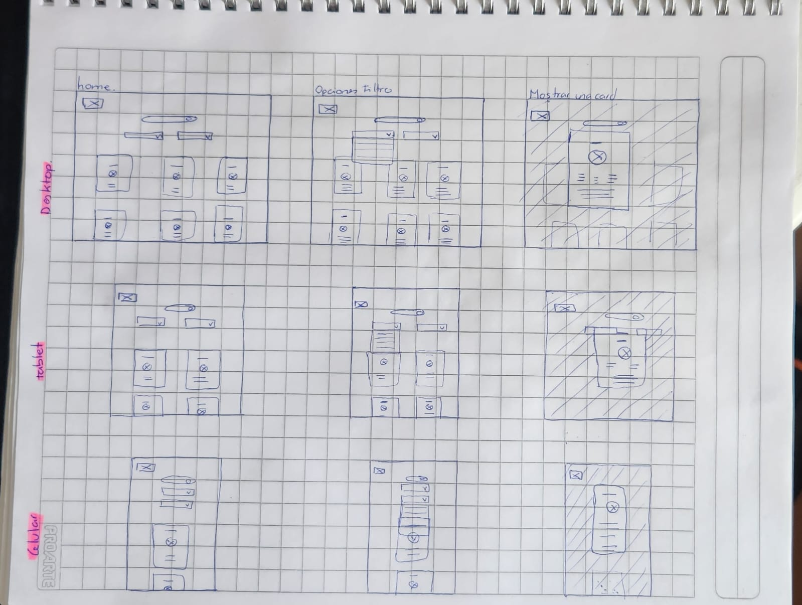

  Luego, se hicieron cambios en base a las historias de usuario, dejando como prototipo de alta fidelidad:
  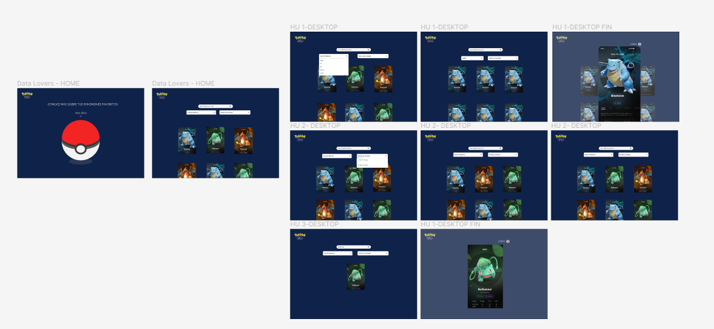
  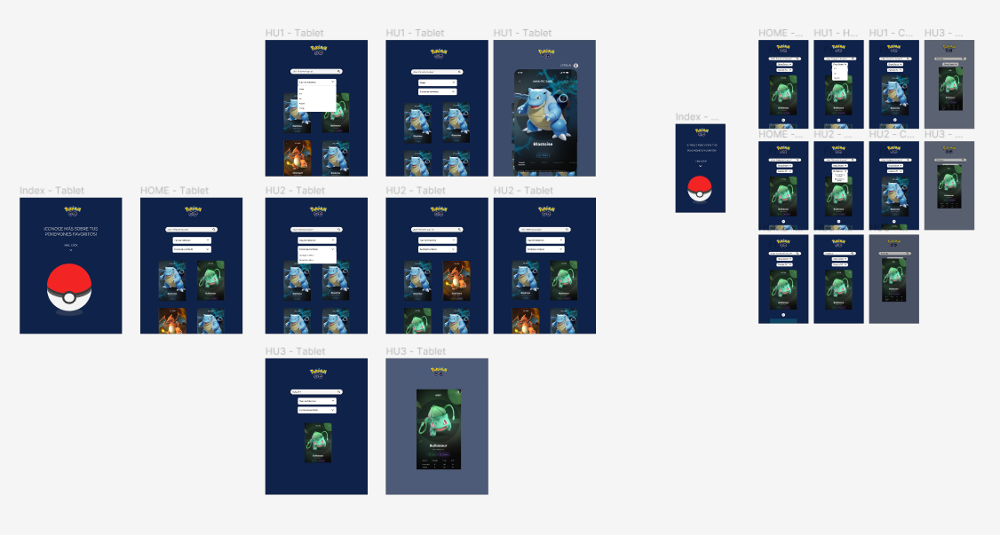

  Puedes ver con mayor detalles el prototipo de alta fidelidad [aquí](https://www.figma.com/file/jOcDABLVVvg3UWZtTKaPDb/High-Prototype-Data-Lovers?type=design&node-id=0-1&t=Oh4NP6cl3LUJdkOz-0)

## 6. Test de Usabilidad

  Luego de completar el proyecto, se realiza un test de usabilidad para probar la funcionalidad del sitio y ver mejoras en caso de profundizar en el proyecto. Se destaca en un buen entendimiento en el manejo de los filtros, visualización y relevancia de la data. Aunque se debe mejorar en detalles como que los nombres no comienzan en mayúscula y la paleta de colores. A continuación se muestran captura de los resultados:
  
  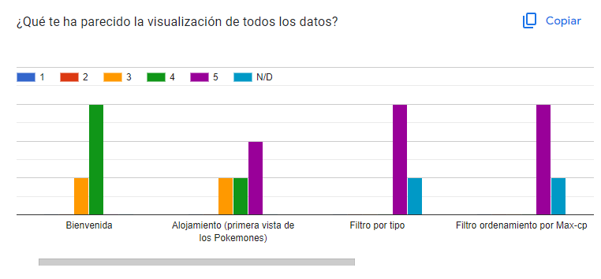
  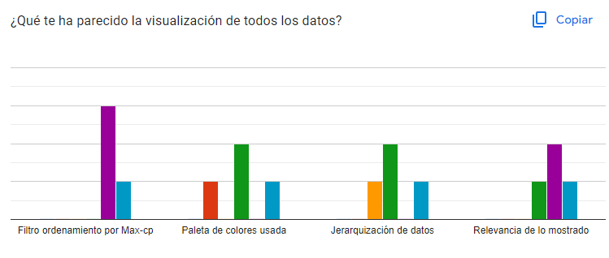
  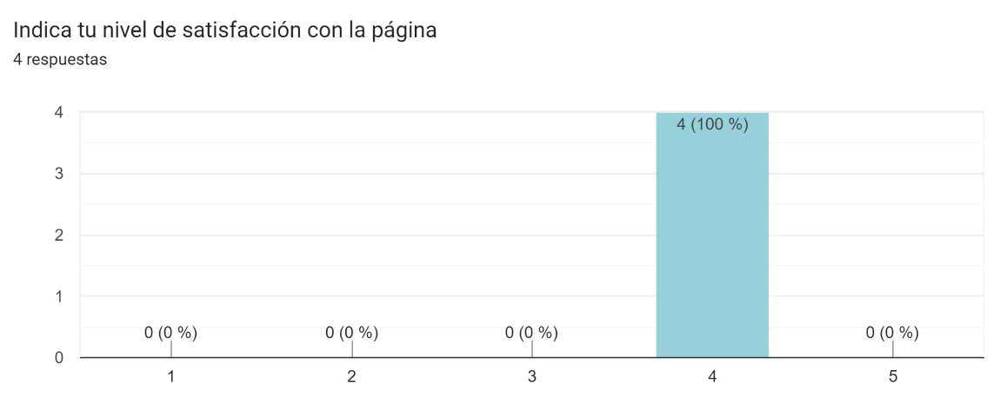
  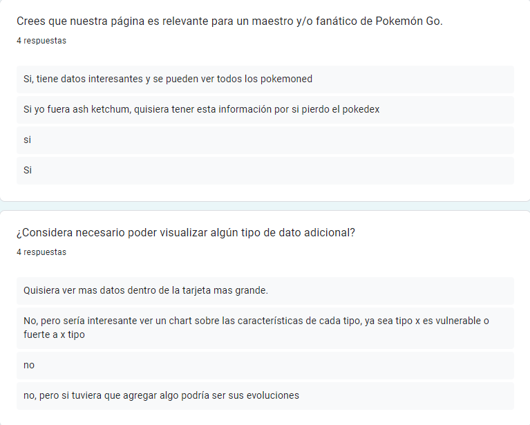
  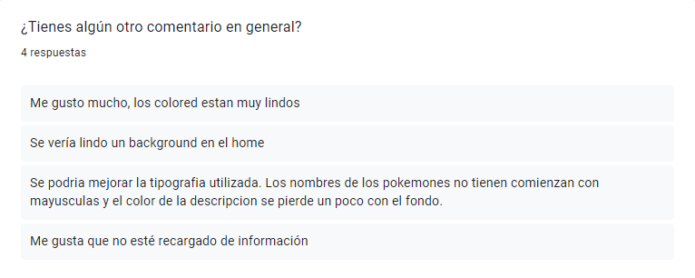

## 7. Proyecto

  Para ver el proyecto final, puedes hacer click [aquí](https://nachasilva.github.io/DEV008-data-lovers/index.html)

  Muestra del proyecto:
  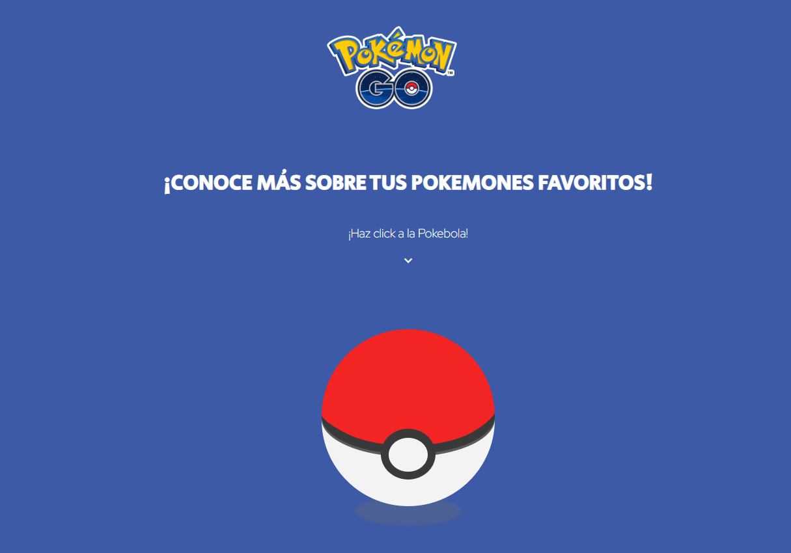
  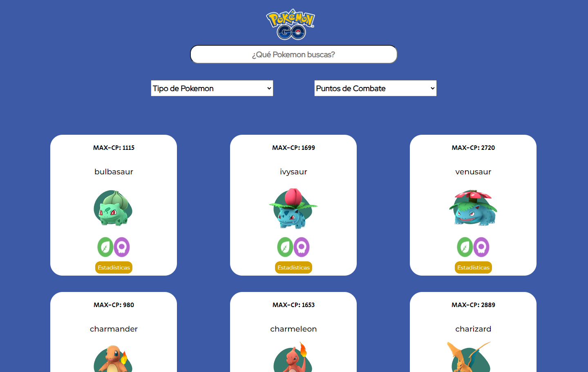
  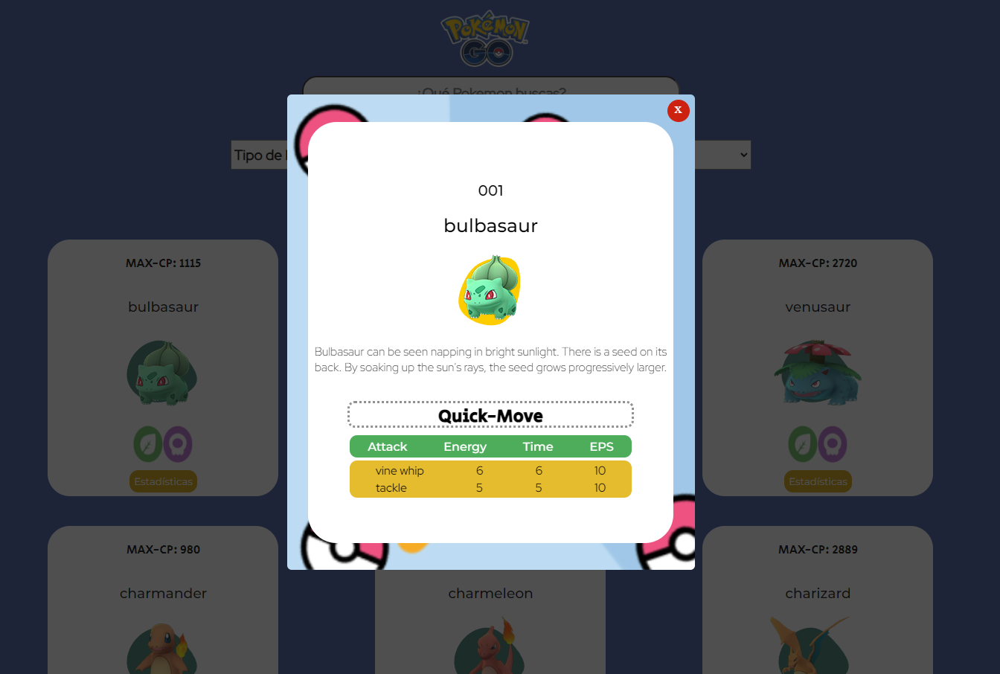

## 8. Checklist

* [x] Usa VanillaJS.
* [x] Pasa linter (`npm run pretest`)
* [x] Pasa tests (`npm test`)
* [x] Pruebas unitarias cubren un mínimo del 70% de statements, functions y
  lines y branches.
* [x] Incluye _Definición del producto_ clara e informativa en `README.md`.
* [x] Incluye historias de usuario en `README.md`.
* [x] Incluye _sketch_ de la solución (prototipo de baja fidelidad) en
  `README.md`.
* [x] Incluye _Diseño de la Interfaz de Usuario_ (prototipo de alta fidelidad)
  en `README.md`.
* [x] Incluye link a Figma en `README.md`.
* [x] Incluye el listado de problemas que detectaste a través de tests de
  usabilidad en el `README.md`.
* [x] UI: Muestra lista y/o tabla con datos y/o indicadores.
* [x] UI: Permite ordenar data por uno o más campos (asc y desc).
* [x] UI: Permite filtrar data en base a una condición.
* [x] UI: Es _responsive_.
